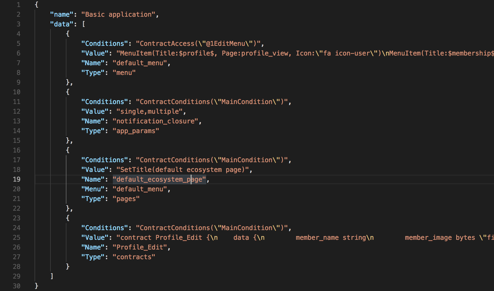
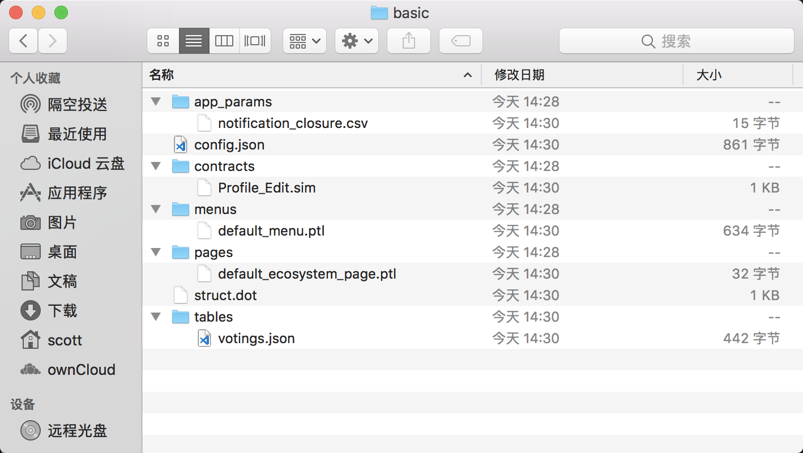
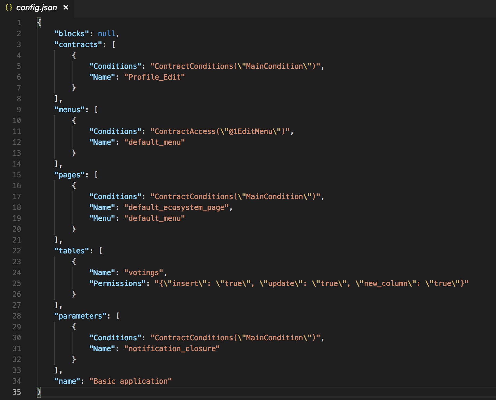

# Applications Packager

G and Chain files packager for import into the Ecosystems created in the Gachain blockchain.
Utilite that can convert import json bundle from/to files of sim, ptl, csv, json.


### struct.dot

Is created in the process of packing or unpacking. Shows the structure of an application. Can be opened using [graphviz](http://graphviz.org/download/) or [webgraphviz](http://webgraphviz.com/)

## build

Windows tip. If you do not plan to work in the console, add "-ldflags -H=windowsgui"

>go build  

Binary files can be found in the current directory 

### on linux for windows

 >env GOARCH=amd64 GOOS=windows CGO_ENABLED=1 CC=/usr/bin/x86_64-w64-mingw32-gcc CXX=/usr/bin/x86_64-w64-mingw32-g++  go build


## Use the examples 

### 1. Unpack file from **basic.json** file to **basic/** folder

**basic.json** - The structure inside the file should look like */gapp/basic.json*, It is generated automatically in the Export module of the platform ecosystem.



Execute the command

```
$ ./gapp basic.json
```

The **basic** folder is generated in the current directory


### 2. Pack files from **basic/** folder to **basic.json** file

**basic/** folder - The folder structure inside the file should look like */gapp/basic/*.



and the **config.json** structure in the directory look like */gapp/basic/config.json*.



Execute the command
```
$ ./gapp basic/
```

The **basic.json** folder is generated in the current directory


